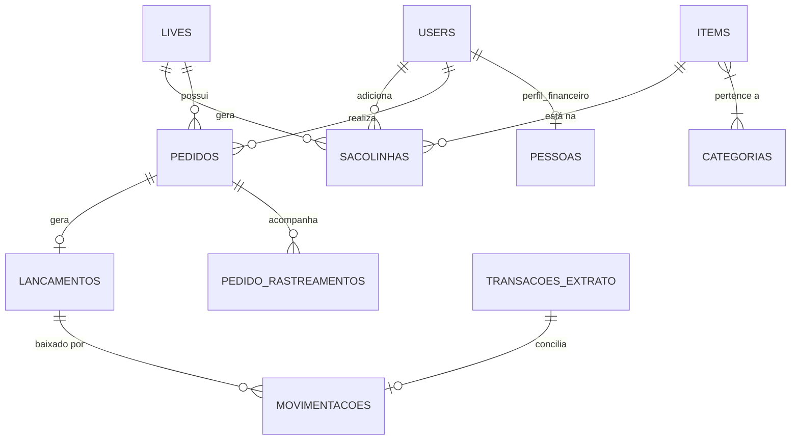

# Visão Geral e Diagrama de Entidades

O banco de dados centraliza informações do e-commerce focado em "Lives" (transmissões ao vivo), englobando gestão de clientes (`users`/`pessoas`), produtos (`items`/`categorias`), eventos de venda (`lives`), carrinhos de compra (`sacolinhas`), faturamento (`pedidos`), e todo o ecossistema financeiro e de conciliação (`lancamentos`, `movimentacoes`, `transacoes_extrato`).

---

# Detalhamento das Tabelas Principais

## Tabela: `users`
**Finalidade:** Armazena os usuários do sistema, abrangendo tanto os clientes que participam das lives quanto os administradores da plataforma.
* **Colunas:**
  * `id` (BigInt, PK) - Identificador único.
  * `name` (String) - Nome do usuário.
  * `email` (String, Unique) - E-mail de acesso.
  * `password` (String) - Senha com hash bcrypt.
  * `role` (Enum) - Define a permissão de acesso.
  * `cpf`, `whatsapp`, `instagram`, `tiktok` (String, Nullable) - Contatos e documentos.
  * `bloqueado` (Boolean) - Se o usuário está bloqueado de participar.
* **Relacionamentos:**
  * `hasOne(Pessoa::class)` - Perfil financeiro gerado automaticamente.
  * `hasMany(Sacolinhas::class)` - Carrinhos formados nas lives.
  * `hasMany(Pedido::class)` - Compras consolidadas.

## Tabela: `items`
**Finalidade:** Catálogo de produtos/peças disponíveis para venda nas lives.
* **Colunas:**
  * `id` (BigInt, PK) - ID da peça.
  * `codigo` (String) - SKU / Código identificador da peça.
  * `nome_do_produto` (String) - Título curto.
  * `descricao` (Text, Nullable) - Detalhamento da peça.
  * `custo`, `preco` (Decimal) - Valores de compra e venda.
  * `status` (String) - Controle de estoque.
  * `image` (String, Nullable) - URL da imagem de capa.
* **Relacionamentos:**
  * `belongsToMany(Categoria::class)` - Herança de dimensões e descontos.
  * `hasOne(Sacolinhas::class)` - Relação direta 1:1 onde a peça (única) vai para a sacolinha.
  * `hasMany(ItemMedia::class)` - Galeria de imagens adicionais.

## Tabela: `lives`
**Finalidade:** Registra cada evento/transmissão ao vivo onde ocorrem as dinâmicas de venda.
* **Colunas:**
  * `id` (BigInt, PK)
  * `data` (Date) - Data agendada da transmissão.
  * `tipo_live` (String) - Dinâmica/Regra da live.
  * `plataformas` (String) - Instagram, TikTok (separado por vírgula).
  * `ativo` (Boolean) - Status em tempo real (aberta/fechada).
  * `encerrada_em` (Datetime, Nullable) - Timestamp real de finalização.

## Tabela: `sacolinhas`
**Finalidade:** Funciona como um "carrinho" temporário dos clientes durante a live, segregado por evento.
* **Colunas:**
  * `id` (BigInt, PK)
  * `user_id` (BigInt, FK) - Comprador.
  * `item_id` (BigInt, FK) - Peça selecionada.
  * `live_id` (BigInt, FK) - Origem da venda.
  * `quantity` (Int) - Quantidade.
  * `price` (Decimal) - Preço unitário congelado no momento da adição.
  * `status` (String) - Controle da vida útil na sacolinha (Global Scope oculta os que já viraram "pedido").

## Tabela: `pedidos`
**Finalidade:** Fechamento da venda. Agrupa os itens, frete, descontos e liga com o gateway de pagamento e envio.
* **Colunas:**
  * `numero_pedido` (String, Unique, Indexed)
  * `user_id`, `live_id` (BigInt, FKs)
  * `valor_total`, `valor_frete`, `valor_desconto`, `valor_saldo_utilizado` (Decimal)
  * `status_pedido` (String) - Fases da logística.
  * `status_pagamento` (String) - Aprovado/Pendente.
  * `codigo_rastreamento`, `melhor_envio_id` (String, Nullable) - IDs externos de logística.
  * `inter_txid` (String, Nullable) - TXID de cobrança PIX no Banco Inter.

## Tabela: `transacoes_extrato`
**Finalidade:** Armazena e reflete os registros trazidos do mundo real (OFX bancário ou API Mercado Pago) para bater/conciliar com o sistema.
* **Colunas:**
  * `fitid` (String, Unique) - Transaction ID único do banco/gateway.
  * `data` (Date)
  * `valor_bruto`, `valor_taxa`, `valor_liquido` (Decimal) - Split contábil para registro de taxas em despesa.
  * `tipo` (Enum) - entrada / saida.
  * `status` (Enum) - pendente / conciliado.
  * `origem` (Enum) - mercadopago / banco.
  * `movimentacao_id` (BigInt, Nullable, FK) - Baixa que conciliou esta transação.

---

# Mapeamento de Enums e Status

*(A maioria dos status no banco atual utilizam o tipo `VARCHAR/String` para flexibilidade, porém as regras de negócio em PHP os tratam como enums fechados)*

### Status de Pagamento (Pedidos)
* `pendente`: Aguardando pagamento (boleto, PIX em aberto ou cartão não aprovado).
* `aprovado`: Pagamento concluído/conciliado. O processo logístico é liberado.

### Status do Pedido (Rastreamento Logístico)
* `Pendente`: Aguardando pagamento ou liberação da etiqueta Melhor Envio.
* `Liberado para envio`: Etiqueta paga, pacote na expedição.
* `Postado`: Pacote bipado na transportadora.
* `Em trânsito`: Em rota nacional de transferência.
* `Saiu para entrega`: Ultima milha (Last-Mile).
* `Entregue`: Processo encerrado com sucesso.
* `Cancelado`: Fluxo logístico abortado.

### Transações de Extrato (Financeiro)
* **`tipo`**: `entrada` (Crédito/Receita) | `saida` (Débito/Despesa/Taxas).
* **`status`**: `pendente` (Apenas importada, precisa de destinação) | `conciliado` (Vinculada a um lançamento de pedido ou despesa).
* **`origem`**: `mercadopago` | `banco` (OFX genérico).

### Tipos de Live
* `loja-aberta`: Peças convencionais (preço fixo).
* `leilao`: Dinâmica de lances em tempo real (quem der mais leva a peça para a sacolinha).
* `precinho`: Dinâmica de descontos agressivos pontuais.

---

# Índices e Desempenho

* **Chaves Primárias (PK):** O padrão do banco é o uso extensivo de `id` (bigint unsigned auto_increment) para garantir performance em joins.
* **Foreign Keys (FKs):** O Laravel lida com constraints nas tabelas usando `constrained()`. Exemplo: `user_id` em pedidos deletará / restringirá em cascata dependendo da migration, porém na prática, evita-se exclusões (uso eventual de SoftDeletes).
* **Campos Indexados Fortes:**
  * `users.email` e `users.cpf` para não haver duplicidade de clientes.
  * `pedidos.numero_pedido` (Unique) essencial para busca rápida do Gateway de Pagamento e do webhook (MP / Inter).
  * `transacoes_extrato.fitid` (Unique) vital para idempotência, previne que um extrato subido duas vezes dobre o saldo contábil.
  * `sacolinhas` utiliza um Global Scope (`status != 'pedido'`) nas queries. Se a tabela crescer, um índice no campo `status` torna-se crucial para varreduras mais eficientes.
* **N+1 Proteção:** Como observado na arquitetura (em `ClienteController` etc), o uso massivo de `Eloquent::with()` compensa a carga de tabelas associativas sem demandar visões materializadas para telas administrativas.
